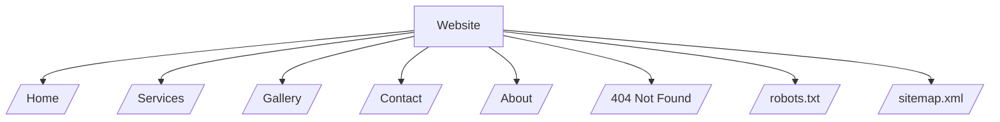
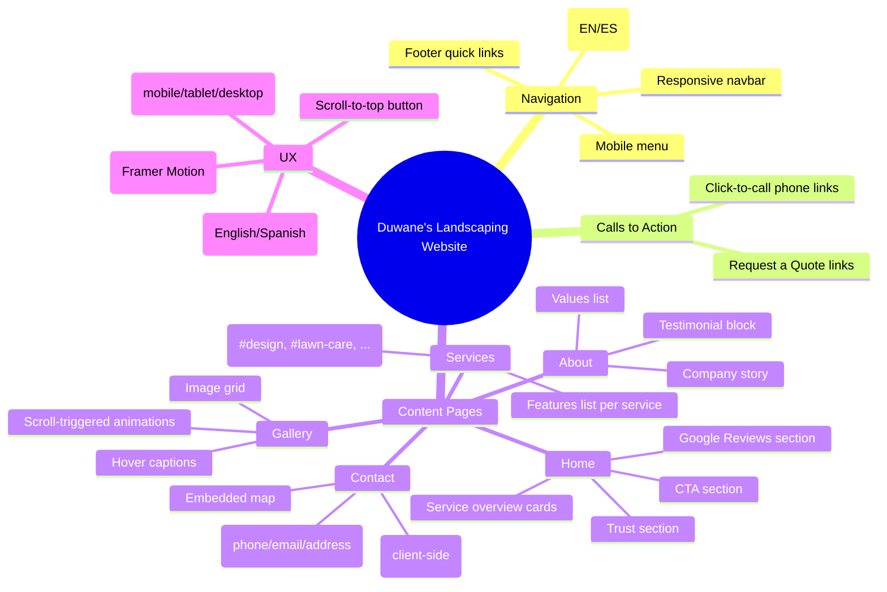

# Website Features (Client Summary)

## 1) Site Map (Pages)



## 2) User-Facing Features



## 3) Technical / SEO Features

- Next.js App Router pages in `app/[locale]/`
- Internationalization (i18n) support via `next-intl`
- SEO metadata in `app/[locale]/layout.tsx` (title/description/robots, canonical)
- Structured data (JSON-LD) via `components/JsonLd.tsx`
- Auto-generated `robots.txt` (`app/robots.ts`) and `sitemap.xml` (`app/sitemap.ts`)
- Remote image support configured for Unsplash in `next.config.ts`

## 4) Notes (Current Behavior)

- The contact form is UI-only (it shows a success alert and clears fields). It does not send email unless you connect a backend/service.
- Some images are currently placeholders (Unsplash backgrounds and placeholder blocks on Services/About).

## 5) Visual Architecture Overview

```mermaid
graph TD
    %% Styles
    classDef container fill:#f9f9f9,stroke:#333,stroke-width:2px;
    classDef feature fill:#e1f5fe,stroke:#0277bd,stroke-width:1px,color:black;
    classDef page fill:#e8f5e9,stroke:#2e7d32,stroke-width:1px,color:black;
    classDef tech fill:#fff3e0,stroke:#ef6c00,stroke-width:1px,color:black;

    Visitor((Website Visitor))

    subgraph WebApp ["Duwane's Landscaping Web Application"]
        direction TB
        
        subgraph TopNav ["Global Navigation"]
            Nav[Responsive Menu]:::feature
            Lang[Language Toggle (EN/ES)]:::feature
        end

        subgraph Pages ["Page Content"]
            Home[Home Page]:::page
            About[About Us]:::page
            Services[Services List]:::page
            Gallery[Photo Gallery]:::page
            Contact[Contact Page]:::page
        end

        subgraph Features ["Interactive Features"]
            Form[Contact Form]:::feature
            Map[Google Maps Embed]:::feature
            Call[Click-to-Call]:::feature
            Motion[Scroll Animations]:::feature
        end

        subgraph SEO_Tech ["Technical Foundation"]
            SEO[SEO Metadata & JSON-LD]:::tech
            i18n[International Routing]:::tech
            Perf[Performance Optimization]:::tech
        end
    end

    Visitor --> Nav
    Visitor --> Lang
    
    Nav --> Home
    Nav --> About
    Nav --> Services
    Nav --> Gallery
    Nav --> Contact

    Contact --> Form
    Contact --> Map
    Home --> Call
    
    Pages -.-> Motion
    WebApp -.-> SEO_Tech
```
